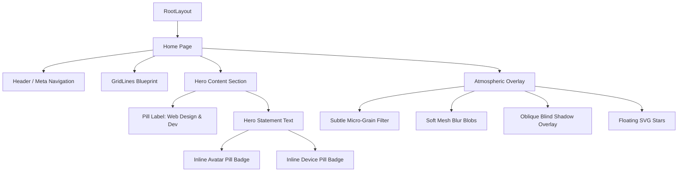

# Design Spec: Premium Editorial Portfolio Home Page

This document outlines the detailed architectural, design, and interactive specifications for the Next.js portfolio home page. The project is styled to feel like a high-end editorial website—featuring a sandstone warm-cream canvas, vertical gridlines, custom typography, in-text inline media badges, floating abstract shapes, and soft atmospheric lighting.

## 1. Design & Aesthetic Guidelines

| Parameter | Value | Description |
| :--- | :--- | :--- |
| **Primary Canvas** | `#F1EFEA` (Warm Cream / Sandstone) | A natural, premium off-white base that feels tactile and organic. |
| **Secondary Accent** | `#203022` (Pine Green / Forest Dark) | A rich, deep botanical green used for main display headlines, nav text, and branding. |
| **Display Font** | `Melodrama` (Serif, Fontshare) | High-contrast, expressive serif display font for headers and logos. |
| **Sans Serif Font** | `Satoshi` or `Geist` (Sans-Serif) | A clean, modern sans-serif for metadata, labels, and paragraph navigation. |
| **Grid Structure** | Asymmetric blueprint grids | 6 vertical faint borders spanning full viewport height (`min-h-[100dvh]`). |
| **Atmospheric Elements** | Mesh gradients & Window Shadows | Soft-focus coral-rose, sky-indigo, and spring-green blobs, combined with an oblique window blind shadow casting down the screen. |

---

## 2. Typography & Font Integration

We will load **Melodrama** and **Satoshi** directly using a Fontshare CSS stylesheet import in `globals.css`. 

```css
@import url('https://api.fontshare.com/v2/css?f[]=melodrama@300,400,500,600,700&f[]=satoshi@300,400,500,700&display=swap');
```

In Tailwind CSS v4, we map these web fonts inside our `@theme` block:

```css
@theme {
  --font-display: 'Melodrama', serif;
  --font-sans: 'Satoshi', sans-serif;
  --color-brand-green: #203022;
  --color-bg-sand: #F1EFEA;
}
```

---

## 3. Architecture & Component Blueprint



### Component Details:

1. **`GridLines`**
   - Renders 6 absolutely positioned vertical lines spaced evenly across the viewport (`left: 0%`, `left: 20%`, `left: 40%`, etc.).
   - Border styling is `border-r border-stone-200/40` or `border-stone-300/30`.

2. **`Atmosphere`**
   - **Background Mesh:** 3 radial gradient nodes positioned absolute with high blur (`blur-3xl`, opacity 0.25 to 0.35) in warm coral, sky indigo, and spring green.
   - **Window Shadow Overlay:** A fixed overlay applying a soft linear gradient mimicking light streaming through wooden blinds.
   - **Floating Stars:** Organic SVG star shapes positioned dynamically, utilizing subtle CSS hover translations or infinite CSS floating keyframe animations.

3. **`InlineBadge`**
   - Accepts an `src` image link, `alt` tag, and dimensions.
   - Renders an inline-block container with `rounded-full` or pill-like properties, housing a beautifully cropped image to embed fluidly inside the serif text.

4. **`Header`**
   - Symmetrically sits at the top of the gridlines.
   - Houses the "marimba. designs" typography, digital designer roles, geographic location, and vertical nav points.

---

## 4. Interaction & Motion Physics

- **Page Entrance:** The statement words will mount with a sequential fade-in and slight vertical translation.
- **Micro-animations:**
  - The floating SVG stars will have an infinite float/rotation keyframe animation.
  - Hovering on navigation or interactive labels will use spring physics (`transition-all duration-300 ease-out`).
  - Active button states will scale down to `scale-[0.98]` to feel tactile and responsive.

---

## 5. Accessibility, Performance, and SEO

- **SEO:** Title tag will be customized to a premium branding standard. Descriptive metadata, single `<h1>` tag for the primary display headline, and proper semantic elements (`<header>`, `<main>`, `<footer>`).
- **Performance:** CSS hardware acceleration (`transform`, `opacity`) for animations. Gradients and blurs are kept light to prevent GPU lag.
- **Accessibility:** Text colors have high contrast against the sand background. Screen readers will read the inline badges correctly using standard `aria-label` tags.

---

## 6. Self-Review Checklist

- [x] **No Placeholders:** Realistic content used throughout.
- [x] **Consistency:** Hex colors match references perfectly (`#F1EFEA` and `#203022`).
- [x] **Accessibility:** Correct contrast levels and semantic HTML layout.
- [x] **Performance:** Strictly optimized CSS and layout transitions.
